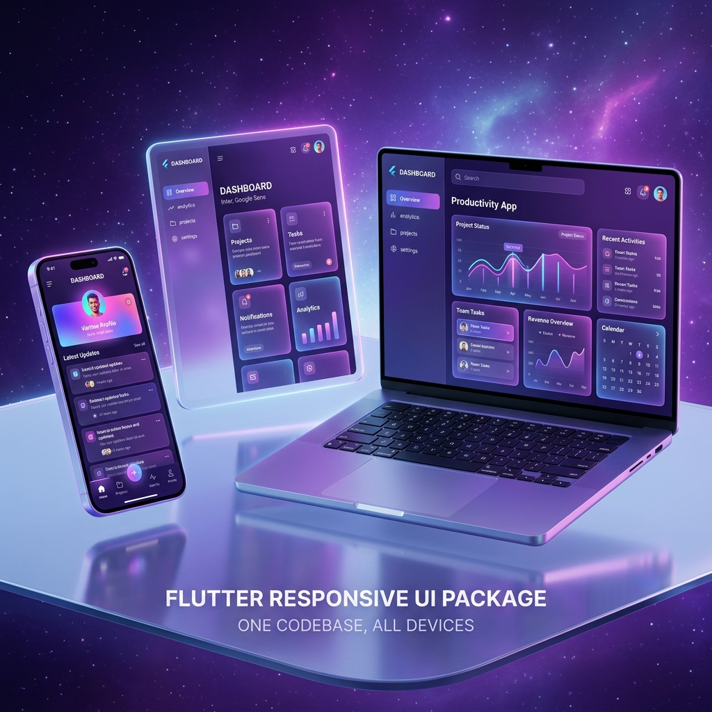
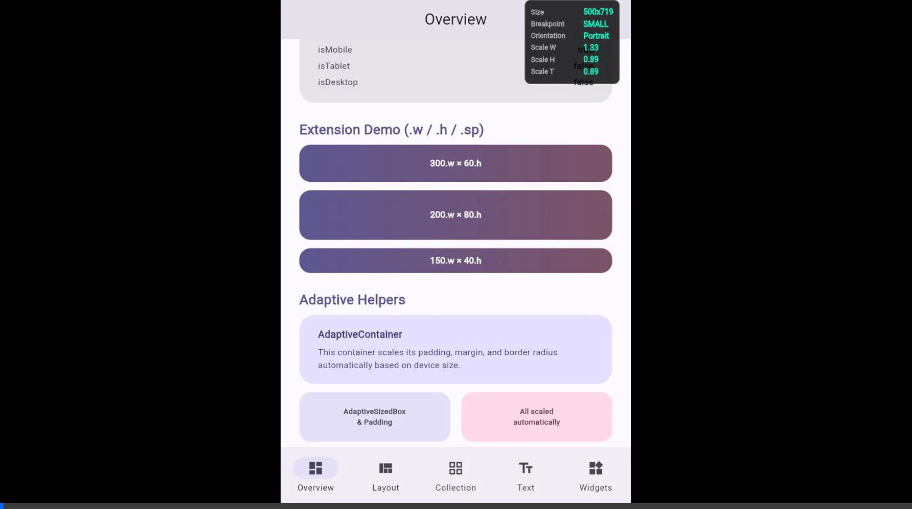

# dynamic_layouts

[](https://github.com/GithubUser18974/dynamic_util)
[](https://pub.dev/packages/dynamic_layouts)
[](https://opensource.org/licenses/MIT)

      <div>
        <h2>Contact Me</h2>
      <div align="center">
  <a href="mailto:mohamedaraby1296@gmail.com"></a>&nbsp;&nbsp;
  <a href="https://linkedin.com/in/mohamed-araby"></a>&nbsp;&nbsp;
  <a href="https://github.com/GithubUser18974"></a>&nbsp;&nbsp;
  <a href="https://freelancer.com/u/mohamed1araby"></a>&nbsp;&nbsp;
  <a href="https://wa.me/201099057109"></a>
</div>
</div>



A lightweight, dependency-free Flutter package for building fluid, heavily responsive, adaptive UI rendering across mobile, tablet, and desktop screens natively. 

Built on a modern, strictly reactive `InheritedWidget` architecture (`AdaptiveScope`), it efficiently responds to window resizing, layout transitions, safe-area, and orientation constraints natively.

---

## 📱 Adaptive Demos

Experience how the package handles layout shifts from mobile to desktop seamlessly.

| Mobile Experience | Tablet & Desktop Experience |
| :---: | :---: |
|  |  |
| *Bottom Navigation & List Layout* | *Navigation Rail & Grid Layout* |

---

## ⚡ Setup & Architecture

### 1. Initialize AdaptiveScope
Inject `AdaptiveScope` at the application root passing a continuous `ScreenConfig.watch(context)`. 

> [!IMPORTANT]
> This creates a unified configuration reacting to `MediaQuery` bounds across the entire Flutter ecosystem natively.

```dart
import 'package:dynamic_layouts/dynamic_layouts.dart';

class MyApp extends StatelessWidget {
  @override
  Widget build(BuildContext context) {
    return AdaptiveScope(
      config: ScreenConfig.watch(
        context, 
        designWidth: 375, // Your figma/design base width
        designHeight: 812 // Your figma/design base height
      ),
      // NEW: Clamping max width for ultra-wide screens
      maxContentWidth: 1000, 
      child: MaterialApp(
        builder: (context, child) => AdaptiveDebugOverlay(child: child!),
        home: HomeScreen(),
      ),
    );
  }
}
```

### 2. Contextual Dimensional Scaling
Safely extract responsive bounds tailored downwards into the tree. Your fonts, padding, and alignments automatically morph based on constraints.

```dart
Container(
  // Scales 200 physical pixels natively relative to current bounding constraints
  width: context.w(200),    
  height: context.h(100),   
  padding: EdgeInsets.all(context.w(16)),
  child: Text(
    'Responsive Font',
    style: TextStyle(fontSize: context.sp(16)),  // Text scales independently
  ),
)
```

> [!TIP]
> Global static `.w`, `.h`, `.sp` variables extended on `num` are preserved for backward compatibility if you run `ScreenConfig.init()` strictly.

### 3. Scaling Basis
Choose how your dimensions scale. By default, it uses `shortestSide` (similar to `flutter_screenutil`), but you can explicitly scale by `width` or `height` for specialized designs.

```dart
AdaptiveScope(
  config: ScreenConfig.watch(
    context, 
    defaultScaleBasis: ScaleBasis.width // Scale everything purely by width
  ),
  child: MyApp(),
)
```

### 4. Fluid Scaling (No Breakpoint Jumps)
If you prefer smooth, linear scaling instead of stepping through breakpoints, use the `.fluid()` extension. It smoothly interpolates a value based on the current screen width.

```dart
Text(
  'Fluid Text',
  style: TextStyle(
    // Scales smoothly from 16px to 32px as screen width increases
    fontSize: context.fluid(16, 32), 
  ),
)
```

---


## 🛠️ Feature & UI Components Matrix

### AdaptiveValue<T>
Avoid `if/else` constraint logic inside builders. Use `AdaptiveValue` to conditionally map configurations directly.

```dart
// Auto-resolves based on current screen boundary.
final paddingLimit = const AdaptiveValue<double>(
  mobile: 16.0,
  tablet: 32.0,
  desktop: 64.0,
).resolve(context);
```

### AdaptiveLayout
Return entirely distinct widget blueprints depending on the bounds. Supports native fallback. Use **`AnimatedAdaptiveLayout`** for smooth cross-fades when crossing breakpoints.

### AdaptiveGrid
Automagically scale grid layout matrices.
- **Breakpoint-driven**: Provide a responsive `crossAxisCount` resolving automatically via `AdaptiveValue`.
- **Auto-calculated**: Provide a `maxColumnWidth` to let the grid calculate the columns based on available space.

```dart
AdaptiveGrid(
  itemCount: 20,
  maxColumnWidth: 150, // Auto-column calculation!
  itemBuilder: (context, index) => Card(child: Text('Item $index')),
)
```

### AnimatedAdaptiveLayout
A drop-in replacement for `AdaptiveLayout` that provides smooth cross-fades when crossing breakpoints.

```dart
AnimatedAdaptiveLayout(
  duration: Duration(milliseconds: 500),
  switchInCurve: Curves.easeInOut,
  mobile: MobileView(),
  tablet: TabletView(),
  desktop: DesktopView(),
)
```

### AdaptiveCollectionView
Dynamically shift an axis iteration rendering natively as a `ListView` on tight mobile bounds, but elevating to a `GridView` seamlessly on tablets/desktops.

### AdaptiveSliverGrid
A sliver equivalent of `AdaptiveGrid`. Perfect for complex scrolling layouts inside a `CustomScrollView`. Automatically handles columns via `crossAxisCount` or `maxColumnWidth`.

```dart
CustomScrollView(
  slivers: [
    AdaptiveSliverGrid(
      itemCount: 20,
      maxColumnWidth: 200, // Scales nicely across any device
      itemBuilder: (context, index) => Card(child: Text('Item $index')),
    ),
  ],
)
```

### AdaptiveWrap
Flipping between vertical `Column`s and horizontal `Row`s seamlessly based on a specified breakpoint target.

### AdaptiveMasterDetail
A robust two-pane layout system.
- **Mobile**: Stacks views and handles stateful layered navigation (drilling down).
- **Tablet/Desktop**: Splits the screen side-by-side without needing a custom router.

### Adaptive Forms Suite
A collection of widgets specifically designed to make data-entry responsive and native-feeling.

- **`AdaptiveFormRow`**: Stacks form fields vertically on mobile, but spreads them laterally into responsive grid alignments on desktops.
- **`AdaptiveTextField`**: Automatically adjusts its internal `InputDecoration` to be spacious on mobile (large touch targets) and compact on desktop (`isDense = true`).
- **`AdaptiveFormSubmit`**: A button wrapper that spans `double.infinity` width on mobile, but gracefully shrinks and aligns to the trailing edge on desktop.

```dart
AdaptiveFormRow(
  label: Text('Email Address'),
  input: AdaptiveTextField.form( // Automatically scales density!
    decoration: InputDecoration(hintText: 'user@example.com'),
  ),
),
AdaptiveFormSubmit(
  child: FilledButton(onPressed: () {}, child: Text('Submit')),
)
```

### Keyboard & Safe Area Intelligence
These wrappers solve common mobile-specific pain points while gracefully getting out of the way on desktop and web environments.

- **`AdaptiveSafeArea`**: Acts as a normal `SafeArea` on mobile to dodge notches, but intelligently bypasses itself on web/desktop to prevent unnecessary padding.
- **`AdaptiveKeyboardAvoider`**: Applies `MediaQuery.viewInsets.bottom` padding only on mobile touch devices when the software keyboard opens, allowing you to use `resizeToAvoidBottomInset: false` on your Scaffolds while still protecting specific scrollable areas.

### AdaptiveNavigationScaffold
An intelligent `Scaffold` that renders a native `BottomNavigationBar` on smaller screens, instantly snapping into a `NavigationRail` on Desktop limits.

### AdaptiveDrawerScaffold
A Scaffold designed for complex desktop apps that use a sidebar.
- **Mobile**: Acts as a standard modal `Drawer` hidden behind a hamburger menu.
- **Tablet/Desktop**: The drawer is permanently "docked" as a fixed side-pane next to your main content.

```dart
AdaptiveDrawerScaffold(
  drawer: CustomSidebarWidget(),
  appBar: AppBar(title: Text('Dashboard')),
  body: MainContentWidget(),
)
```

---

## ⚙️ Breakpoint Architectures

Built-in tailored presets corresponding to industry tracking metrics:

```dart
BreakpointConfig.material3();
BreakpointConfig.bootstrap();
BreakpointConfig.tailwind();
```

## License
MIT — see [LICENSE](LICENSE)
